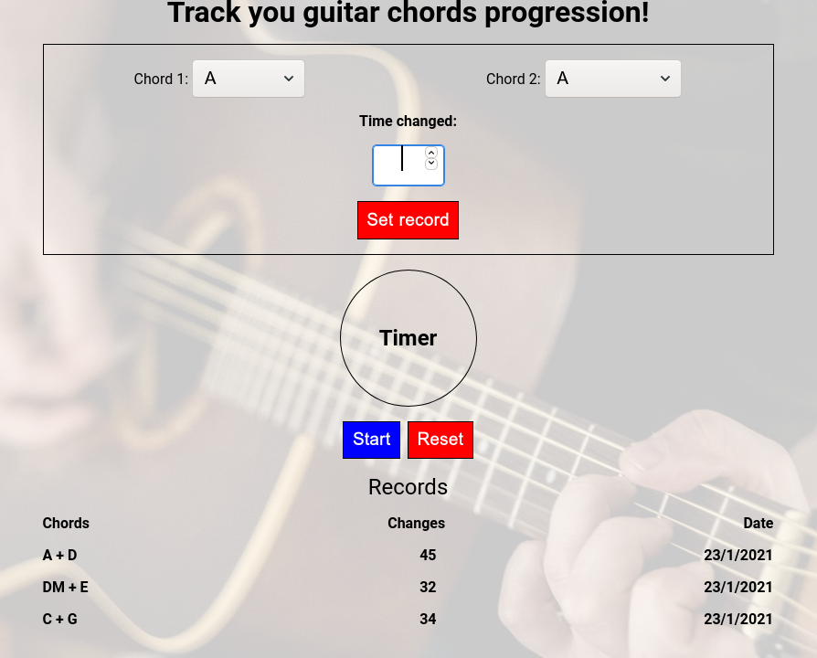

## What is the purpose of this project?

If you are learning to play the guitar, there is a great practice method called "1 minute chord changes" in which you pick a couple of chords you want to practice and try to change between those two chords as much times as you can within that minute.  
In this project, you can set a 1minute timer and start changing between the selected chords!  
Once the timer is finished, type the amount of times you managed to change between the chords.  
If this is your first time practicing this set of chords, it will be shown in the records list below.  
If you already practiced those chords but didn't break you last record, no worries, you can always try again!  
But if you broke your former record, the new record will be shown in the list below  
The data is saved on your browser storage so you can always come back and challenge yourself!  

  

## For this project I used:

- Typescript   

- Sass   

- OOP  
